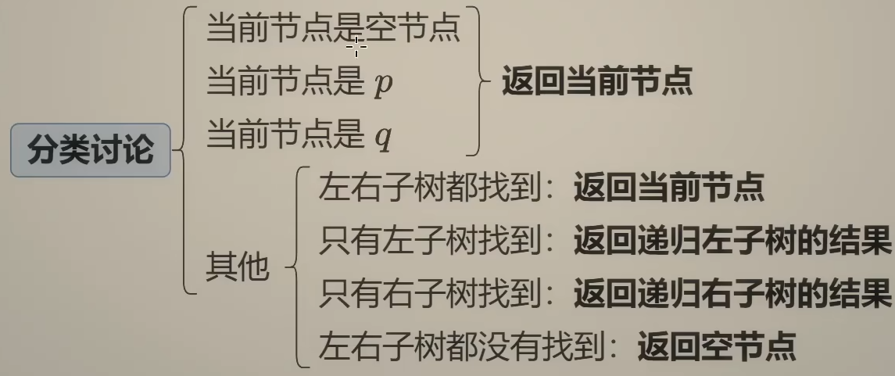

# 236. 二叉树的最近公共祖先

给定一个二叉树, 找到该树中两个指定节点的最近公共祖先。

百度百科中最近公共祖先的定义为：“对于有根树 T 的两个节点 p、q，最近公共祖先表示为一个节点 x，满足 x 是 p、q 的祖先且 x 的深度尽可能大（一个节点也可以是它自己的祖先）。”

## 思路

分类讨论，对于当前节点，一共有四种情况，1.它是空节点；2.它是 p；3.它是 q；4.其它情况（是否找到 p 或 q：(1)左右子树都找到(2)只有左子树找到(3)只有右子树找到(4)左右子树都没有找到）

对于当前节点是空节点的情况，直接返回空节点；如果当前节点是 p 或 q 的话，就不需要继续递归寻找了，比如当前节点是 p，那么无论 q 是 p 下面的哪个节点，最近公共祖先都是 p，所以就不需要继续递归了；如果左右子树都有 p 和 q，那么最近公共祖先就是当前节点；如果只有左子树找到了，右子树没有，那么最近公共祖先肯定在左子树中，所以返回递归左子树后的结果就行了。



首先判断 root，如果root是空或者 p 或者 q，那么就返回 root，然后递归左边和右边，如果左右都有，就返回 root，如果只有左边，就返回左边，否则返回右边。

## 做法

```python

def lowestCommonAncestor(root, p, q):
    if root is None or root is p or root is q:
        return root
    left = self.lowestCommonAncestor(root.left, p, q)
    right = self.lowestCommonAncestor(root.right, p, q)
    if left and right:
        return root
    if left:
        return left
    return right

```

# 235. 二叉搜索树的最近公共祖先

给定一个二叉搜索树, 找到该树中两个指定节点的最近公共祖先。

百度百科中最近公共祖先的定义为：“对于有根树 T 的两个结点 p、q，最近公共祖先表示为一个结点 x，满足 x 是 p、q 的祖先且 x 的深度尽可能大（一个节点也可以是它自己的祖先）。”

## 思路

利用二叉搜索树的性质，二叉搜索树的性质是左子树的节点值比当前节点值小，右子树的节点值都比当前节点值大，如果 p 和 q 的节点值都小于当前节点值，就可以直到 p 和 q 都在左子树中，所以最近公共祖先也在左子树中，那递归左子树就好了，同样的，如果 p 和 q 的节点值都大于当前节点值，那么就可以直到 p 和 q 都在右子树中，所以最近公共祖先也在右子树中，递归右子树就好了。对于其它情况，如果 p 和 q 分别在左右子树中，那么最近公共祖先就是当前节点，或者当前节点是 p 或者是 q，那么最近公共祖先也是当前节点。所以可以分成这样几种情况，最后还有一个问题，还需要判断当前节点是空节点吗，首先题目保证 p 和 q 都在这棵树中，那么根节点肯定不是空节点，如果都在左边，那么说明左子树不是空节点，如果都在右边，那么说明右子树不是空节点，最后对于其余情况，当前节点都不是空节点，所以不需要判断当前节点是不是空节点。

首先拿到当前节点值，如果 p 的节点值小于当前节点，并且 q 的节点值也小于当前节点，那么最近公共祖先就在左子树中，递归传入左子树，如果 p 的节点值大于当前节点，并且 q 的节点值也大于当前节点，递归传入右子树，其余情况就是当前节点了。

## 做法

```python

def lowestCommonAncestor(root, p, q):
    x = root.val
    if x < p.val and x < q.val:
        return lowestCommonAncestor(root.right, p, q)
    if x > p.val and x > q.val:
        return lowestCommonAncestor(root.left, p, q)
    return root

```


