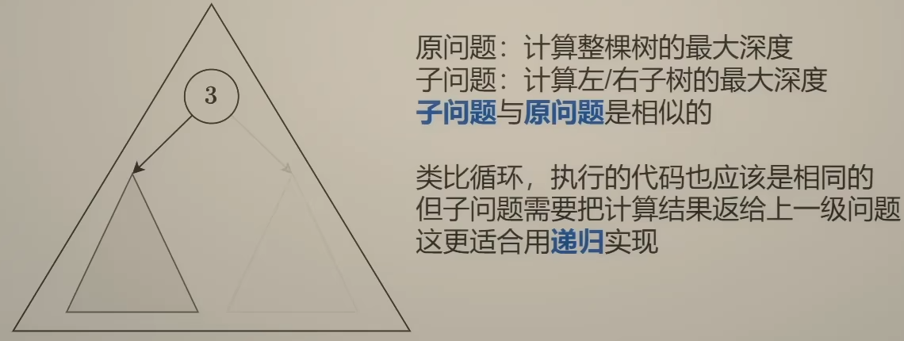

# 104. 二叉树的最大深度

给定一个二叉树 root ，返回其最大深度。

二叉树的 最大深度 是指从根节点到最远叶子节点的最长路径上的节点数。

## 思路1

做二叉树题目的时候往往需要用到递归，不要一开始就陷入细节，而是思考整棵树与其左右子树的关系。

整棵树的最大深度 = max(左子树的最大深度，右子树的最大深度) + 1




计算左子树右子树的最大深度和计算整棵树的最大深度是相似的，分别叫做子问题和原问题。需要把计算结果返回给它的上一级问题，而它的上一级问题又会把计算结果返给上上一级问题，从这个角度上看，用递归实现是更合适的，从原问题出发，把问题不断分解成更小的子问题，这就是递归中的[递]这个过程，不断递归下去总会有个尽头，也就是递归的边界条件，在这个问题中，边界条件就是空节点，可以直接返回0作为答案，这个返回的过程就是递归中的[归]。用数学归纳法可以证明其正确性。

类似数学归纳法，先写边界条件：当节点为空的时候返回0，因为它没有节点，然后递归计算左子树的最大深度和右子树的最大深度，最后返回它们的最大值 + 1

## 做法1

```python

def maxDepth(root):
    if root is None:
        return 0
    l_depth = maxDepth(root.left)
    r_depth = maxDepth(root.right)

    return max(l_depth, r_depth) + 1
```

## 思路2

在递归的时候，除了把节点传下去，还可以把路径上的节点个数也传下去，根节点这里是 1，它把 1 传下去，递归左子树，把上面收到的这个 1 再 + 1 得到 2，递归右子树也是一样的，然后右子树再递归，它把 2 传下去，这里收到 2，+ 1 之后变成 3。在递归的同时，还可以维护一个全局变量，每次加完 1 之后，就更新这个全局变量的最大值，遍历完这棵树，这个全局变量就是答案了。

## 做法2

```python

def maxDepth(root):
    ans = 0
    def f(node, cnt):
        if node is None:
            return 
        cnt += 1
        nonlocal ans 
        ans = max(ans, cnt)
        f(node.left, cnt)
        f(node.right, cnt)
    f(root, 0)
    return ans 
```


