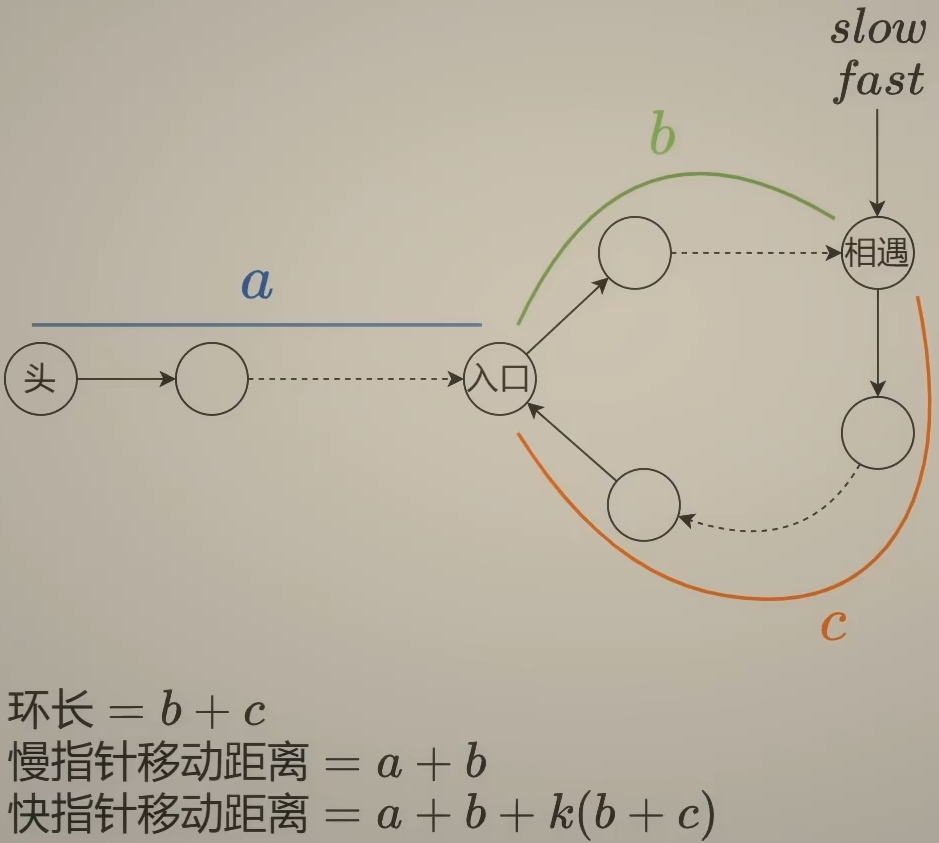
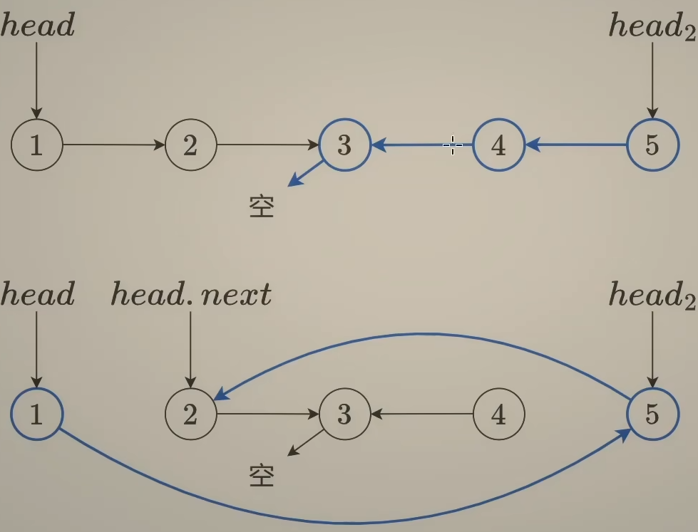

# 876. 链表的中间结点

给你单链表的头结点 head ，请你找出并返回链表的中间结点。

如果有两个中间结点，则返回第二个中间结点。

## 思路

用两个指针指向链表的头节点，一个叫慢指针，一个叫快指针，每次循环慢指针走一步，快指针走两步，比如链表长度为 3 时，循环一次后，慢指针就指向中间节点了。

用数学归纳法可以证明，当链表长度为奇数时，快指针在最后一个节点时，慢指针一定在中间节点，对于偶数长度也是一样，如果快指针指向空，那么慢指针一定在中间节点上。综合这两种情况，当快指针指向空，或者它的下一个节点指向空，这个时候就退出循环。

## 做法 

```python
def solve(head):
    slow = head
    fast = head
    while fast and fast.next:
        slow = slow.next
        fast = fast.next.next
    return slow
```

# 141. 环形链表

给你一个链表的头节点 head ，判断链表中是否有环。

如果链表中有某个节点，可以通过连续跟踪 next 指针再次到达，则链表中存在环。 为了表示给定链表中的环，评测系统内部使用整数 pos 来表示链表尾连接到链表中的位置（索引从 0 开始）。注意：pos 不作为参数进行传递 。仅仅是为了标识链表的实际情况。

如果链表中存在环 ，则返回 true 。 否则，返回 false 。

## 思路

同样使用快慢指针去做，慢指针每次循环走一步，如果图中有环的话，那么慢指针就一定会走到环里，这个时候我们用相对速度来思考，快指针相对于慢指针，它的相对速度是每次循环走一步，快指针一步一步走，肯定能遇上慢指针。

## 做法

```python
def solve(head):
    slow = head
    fast = head
    while fast and fast.next:
        slow = slow.next
        fast = fast.next.next
        if fast is slow:
            return True
    return False
```

# 142. 环形链表Ⅱ

给定一个链表的头节点  head ，返回链表开始入环的第一个节点。 如果链表无环，则返回 null。

如果链表中有某个节点，可以通过连续跟踪 next 指针再次到达，则链表中存在环。 为了表示给定链表中的环，评测系统内部使用整数 pos 来表示链表尾连接到链表中的位置（索引从 0 开始）。如果 pos 是 -1，则在该链表中没有环。注意：pos 不作为参数进行传递，仅仅是为了标识链表的实际情况。

不允许修改 链表。

## 思路



这题不仅要判断是否有环，还需要找到环的入口，设头节点到入口的距离为 a，入口到相遇点的距离为 b，相遇点到入口的距离为 c。

当快慢指针相遇时，慢指针还没有走完一整圈。

环的长度等于 b + c，慢指针移动的距离就是 a + b，快指针走的更快，那它的移动距离就是 a + b 再加上若干倍的环长，由于快指针移动距离是慢指针的两倍，所以 2(a + b) = a + b + k(b + c)，由此推出 a - c = (k - 1)(b + c)。说明如果接着走，slow 从相遇点出发，那它走了 c 步之后就走到入口了，同时 head 也从头节点出发，它走了 c 步之后，根据上面这个等式，它走了 c 步之后，那剩余的这段距离必然是环长的倍数，因此，它俩继续走，最终一定会在入口相遇。

为什么快慢指针相遇时，慢指针没有走完一整圈呢？考虑一个最坏情况，当慢指针进入环的时候，快指针刚好在慢指针前面，用相对速度分析，快指针需要走（环长 - 1）步才能与慢指针相遇，对于其余任何情况，快指针走的距离都不会超过（环长 - 1）步，所以慢指针移动的距离是小于环长的。

## 做法

```python
def solve(head):
    slow = head
    fast = head
    while fast and fast.next:
        slow = slow.next
        fast = fast.next.next
        if fast is slow:
            while slow is not head:
                slow = slow.next
                head = head.next
            return slow
    return None
```

# 143. 重排链表

给定一个单链表 L 的头节点 head ，单链表 L 表示为：

L0 → L1 → … → Ln - 1 → Ln
请将其重新排列后变为：

L0 → Ln → L1 → Ln - 1 → L2 → Ln - 2 → …
不能只是单纯的改变节点内部的值，而是需要实际的进行节点交换。

## 思路

比如链表为1-2-3-4-5，重排后为1-5-2-4-3。首先需要找到 3，然后把 3 后面这段链表反转就得到了5-4-3，可以结合之前的[链表的中间节点]和[反转链表]来完成这两步，这样就得到了两段链表。



把右边这段的头节点叫做 head2，每次循环的时候先把 head 指向 head2，然后 head2指向 head 的 next，然后再把这俩移到它们的下一个节点上。

由于更新了 head 的 next，所以需要提前记录这两个 next，最后更新到 head 上。如此不断循环，直到 head2 指向 3，或者它的 next 是空，就退出循环。

## 做法

```python
def middleNode(head):
    slow = head
    fast = head
    while fast and fast.next:
        slow = slow.next
        fast = fast.next.next
    return slow

def reverseList(head):
    pre = None
    cur = head
    while cur:
        nxt = cur.next
        cur.next = pre
        pre = cur
        cur = nxt
    return pre

def solve(head):
    mid = middleNode(head)
    head2 = reverseList(mid)
    while head2.next:
        nxt = head.next
        nxt2 = head2.next
        head.next = head2
        head2.next = nxt
        head = nxt
        head2 = nxt2
```
    