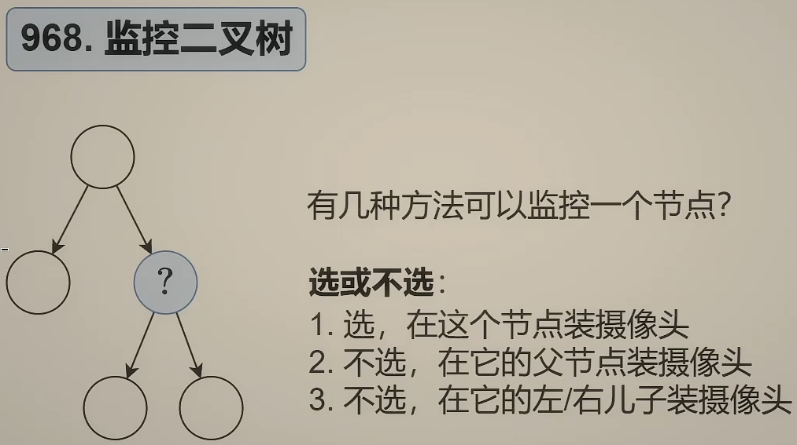
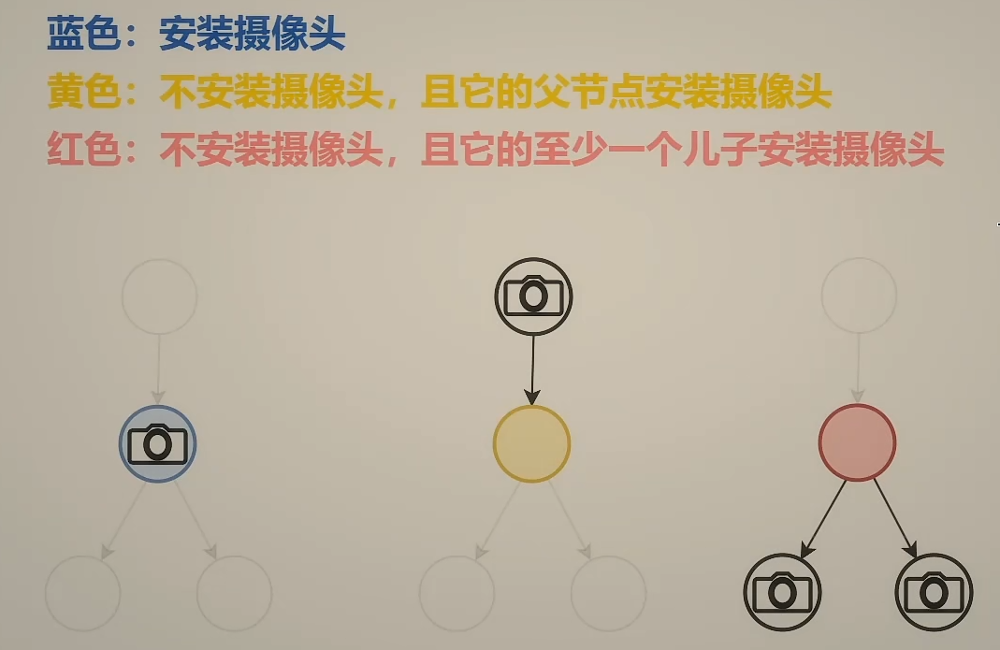

# 树形DP

## 968.监控二叉树
给定一个二叉树，在树的节点上安装摄像头。

节点上的每个摄像头都可以监视**其父对象、自身及其直接子对象**。

计算监控树的所有节点所需的最小摄像头数量。



首先分析根节点装不装摄像头，比如根节点不装摄像头，那么它至少有一个儿子要装摄像头。

除了根节点以外，根据选或不选的思想，有以下三种方式:
1. 选，在这个节点装摄像头
2. 不选，在它的父节点装摄像头
3. 不选，在它的左/右儿子装摄像头



分类讨论

1. 对于蓝色节点来说，它的儿子装不装摄像头都可以，左右儿子可以是任意颜色，所以: 蓝色 = min(左蓝，左黄，左红) + min(右蓝，右黄，右红) + 1
2. 对于黄色节点来说，它的儿子不可能是黄色节点，因为黄色节点的定义就是父节点要安装摄像头，所以: 黄色 = min(左蓝，左红) + min(右蓝，右红)
3. 对于红色节点来说，它的儿子同样不可能是黄色节点，且它的儿子至少有一个是蓝色，所以: 红色 = min(左蓝+右红，左红+右蓝，左蓝+右蓝)
4. 对于根节点来说，它没有父节点，所以根节点不可能是黄色，所以: 最终答案 = min(根节点为蓝色，根节点为红色)

递归边界

将空节点作为递归边界。空节点不能装摄像头，若递归到空节点为蓝色，则返回无穷大，表示不合法；空节点不需要被监控，若递归到空节点为黄色或红色，则返回0
```
class Solution:
    def minCameraCover(self, root):
        def dfs(node): # 首先定义递归函数
            # 先判断递归边界
            if node is None:
                return inf, 0, 0 # 返回无穷大和两个0，分别对应空节点为蓝色，黄色和红色
            l_choose, l_by_father, l_by_children = dfs(node.left) # 递归左子树的结果，分别表示该节点装摄像头、被父节点监控和被子节点监控
            r_choose, r_by_father, r_by_children = dfs(node.right)
            # 讨论dfs(node)的返回值
            choose = min(l_choose, l_by_father, l_by_children) + min(r_choose, r_by_father, r_by_children) + 1 # 在node节点装摄像头的情况
            by_father = min(l_choose, l_by_children) + min(r_choose, r_by_children) # 在node父节点装摄像头的情况
            by_children = min(l_choose+r_choose, l_choose+r_by_children, l_by_children+r_choose) # 在node子节点装摄像头的情况
            return choose, by_father, by_children
        choose, _, by_children = dfs(root)
        return min(choose, by_children)
```

### 变形1

在节点x安装摄像头，需要花费cost[x]，求监控所有节点的最小花费

原问题相当于每个节点的花费都是1，求解该问题只需要将原代码中的+1改为+cost[node]

### 变形2

化简求解红色节点的式子，红色节点至少要有一个蓝色的儿子，若去掉这个约束，则求解红色节点等价于求解黄色节点，即min(蓝1，红1) + min(蓝2，红2)，在此基础上加上至少有一个蓝色节点这一约束即可。当所有红色儿子的值小于蓝色儿子的值时，所有儿子均为红色，可以把其中一个红色儿子改成蓝色，就是改一个蓝色减红色最小的儿子，若蓝色本来就是小于等于红色，则无需修改，因此，在计算黄色公式的基础上，增加一个蓝色减红色的最小值，如果这个最小值是负数，说明至少有一个蓝色儿子小于红色，所以最后和0取最大值。

红色的计算公式更新为: 红色 = 黄色 + max(0, min(蓝1-红1，蓝2-红2))

由此可以看出红色一定大于等于黄色，所以蓝色的计算公式可以去掉带有红色和黄色取最小值的项。