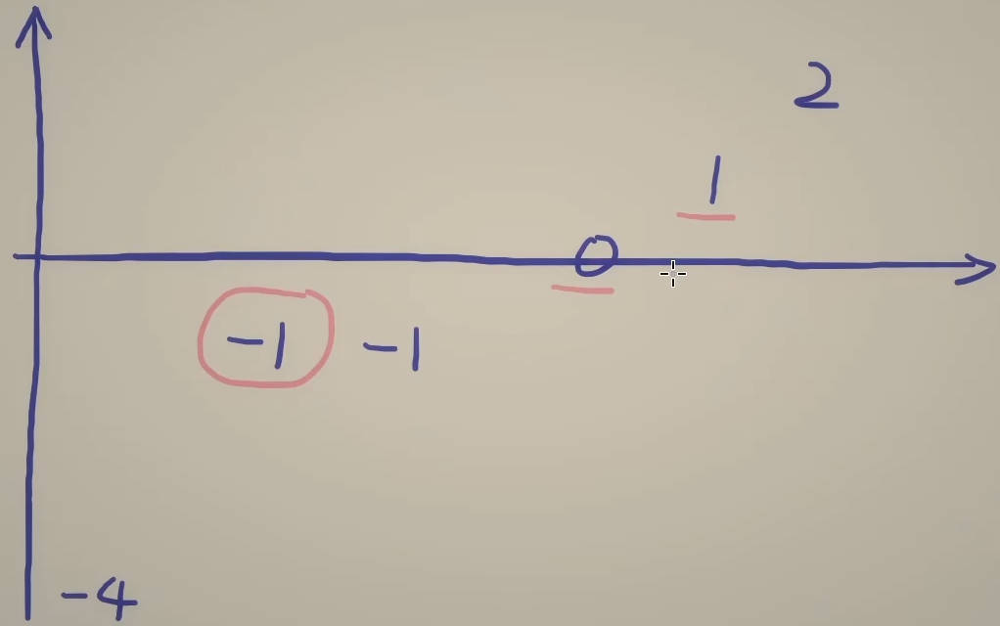

# 15. 三数之和

给你一个整数数组 nums ，判断是否存在三元组 [nums[i], nums[j], nums[k]] 满足 i != j、i != k 且 j != k ，同时还满足 nums[i] + nums[j] + nums[k] == 0 。请你返回所有和为 0 且不重复的三元组。

注意：答案中不可以包含重复的三元组。

## 思路

先排序，然后利用相向双指针，问题转换成剩下的两个数相当等于-nums[i]，如果当前枚举的这个数和上一个数是相同的，直接跳过这个数。

## 做法

枚举第一个数i，从0枚举到n-3，留两个余量。

如果第一个数的下标大于0且该数等于上一个数就continue，因为不能有重复的三元组。

初始化第二个数和第三个数j、k，接while循环，条件为j < k。

while循环内首先求三数之和，如果大于0，k -= 1；如果小于0，j += 1，否则找到答案，ans.append存储答案，还要在这里将重复的j和k也跳过: j += 1, nums[j] == nums[j-1], continue; k -= 1, nums[k] == nums[k+1], continue。

## 优化

如果当前i对应的x和其它最小的两个数之和都大于0，则break，后续没有机会等于0。

如果当前i对应的x和其它最大的两个数之和都小于0，则continue，后续还有机会等于0。
