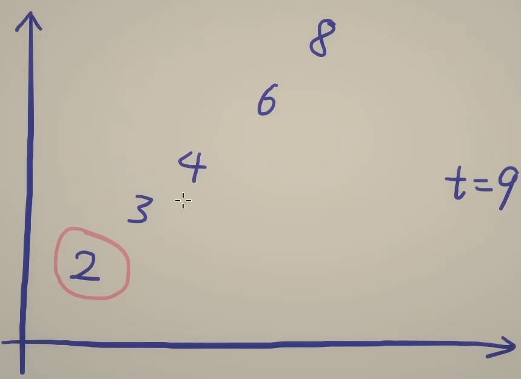

# 167. 两树之和 Ⅱ - 输入有序数组

给你一个下标从1开始的整数数组numbers，该数组已按非递减顺序排列，请你从数组中找出满足相加之和等于目标数target的两个数。如果设这两个数分别是numbers[index1]和numbers[index2]，则1 <= index1 < index2 <=numbers.length。

## 暴力做法

枚举第一个数（一个for循环），然后在后面枚举第二个数（一个for循环）。for循环嵌套for循环，时间复杂度为O(n^2)。

暴力做法没有利用到数组已经排序这个性质。

## 思路

首先选最小的数和最大的数相加，若相加大于target，则他俩之间的所有数和最大的数相加肯定也大于target，直接把最大的数去掉，从剩下的数中寻找答案；若相加小于target，则他俩之间的所有数和最小的数相加肯定也小于target，直接把最小的数去掉，从剩下的数中寻找答案，以此类推。

暴力做法是找两个数加起来和target进行比较，花费O(1)的时间就只知道了O(1)的信息。

优化后的做法是把当前剩下的最小的数和最大的数加起来和target进行比较，比完之后就知道其中一个数和其它任何一个数相加都是小于或大于target的，花费O(1)的时间知道O(n)的信息。

优化的前提是数组是排好序的，如果数组是没有排好序的，那么就不能使用这个算法。

## 做法

初始化两个指针left和right，分别是0和n-1，如果这两个指针指向的数字之和恰好等于target，则返回这两个下标；如果大于target，就去掉最大的数，把右指针向左移动；如果小于target，就去掉最小的数，把左指针向右移动

