# ActorCritic

Reinforcement Learning的方法分为两类：**Policy-based**和**Value-based**，其中Policy-based方法实现Learning an **Actor**（负责做事），Value-based方法实现Learning a **Critic**（不做事，负责打分）。将Actor和Critic结合起来就是**Actor-Critic**的方法。

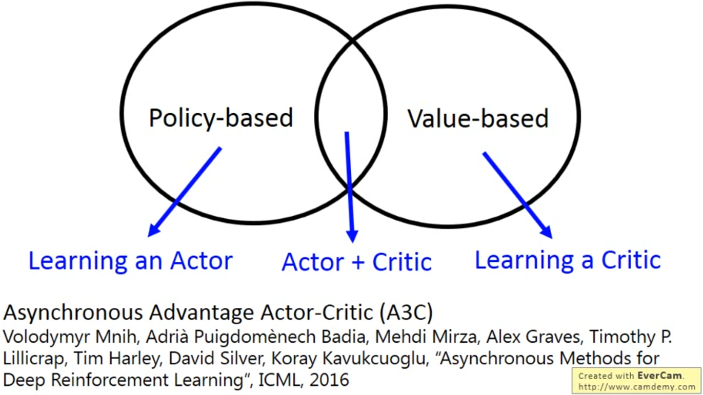
[Asynchronous Methods for Deep Reinforcement Learning(A3C), ICML 2016](https://arxiv.org/abs/1602.01783)

## Actor
### Step 1：Actor就是一个**Function（神经网络）**
1. Actor的**Input**是Agent看到的环境**Observation**，Actor的**Output**是Agent采取的**Action**，通过环境的Reward找出Actor的Function，有些文献称Actor为**Policy**。
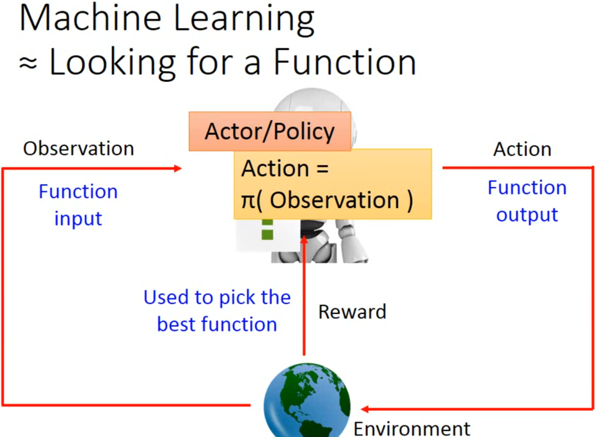
2. Actor采取Action的过程：Input输入至神经网络后得到Output，Output是所有可能动作的概率，Agent从Output中随机选取一个Action，一个Action的概率越大，其被选中的概率就越大，同时Agent还是有可能选择概率没那么大的Action以保证探索性。
3. 传统的Actor以QTable的形式实现，Actor看到一个Observation就采取相应的Action，只适用于离散状态空间，状态空间需要是可穷举的。使用神经网络作为Actor的好处是可以处理连续状态空间
### Step 2：评价Actor的好坏  
1. Monte Carlo method（蒙特卡罗方法）：选定一个由神经网络构成的Actor策略，让Actor与环境进行交互直到结束，得到总奖励Reward。由于Actor的策略具有随机性，即使使用相同的神经网络参数，每次得到的总奖励Reward也不同。因此，用总奖励Reward的期望值衡量Actor的好坏。
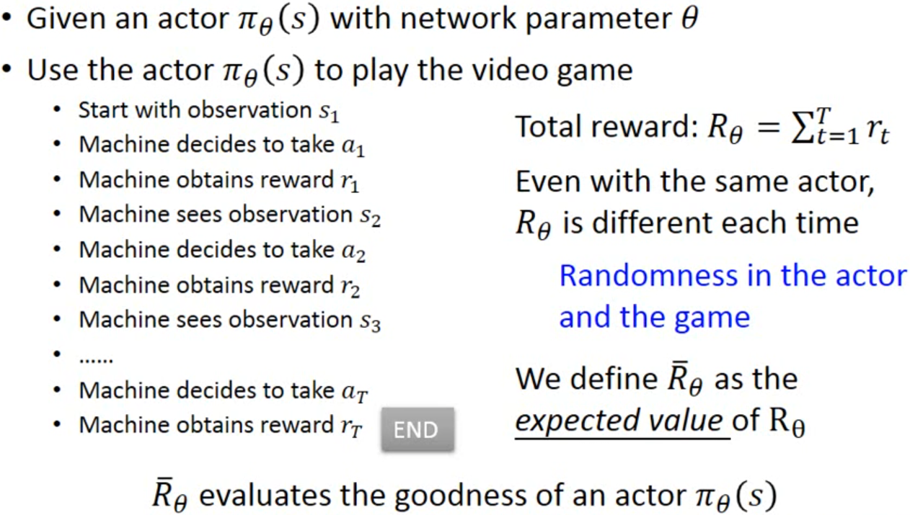
2. 一个Episode就是一个Trajectory，如果你用一个Actor去和环境交互一个Episode，每个Trajectory都有概率被采样，采样概率取决于Actor的神经网络参数。总奖励Reward的期望值就可以表示为每个Trajectory被Actor策略采样的概率乘以对应的总奖励Reward的和。实际上穷举所有Trajectory是不可能的，因此需要让Actor和环境交互n个Episode来近似做n次Sample。
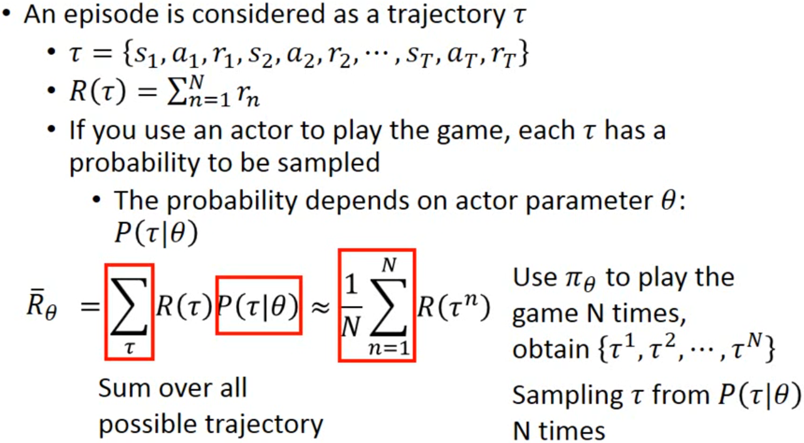
### Step 3：选一个最好的Actor
1. 目标是最大化总奖励Reward的期望值。
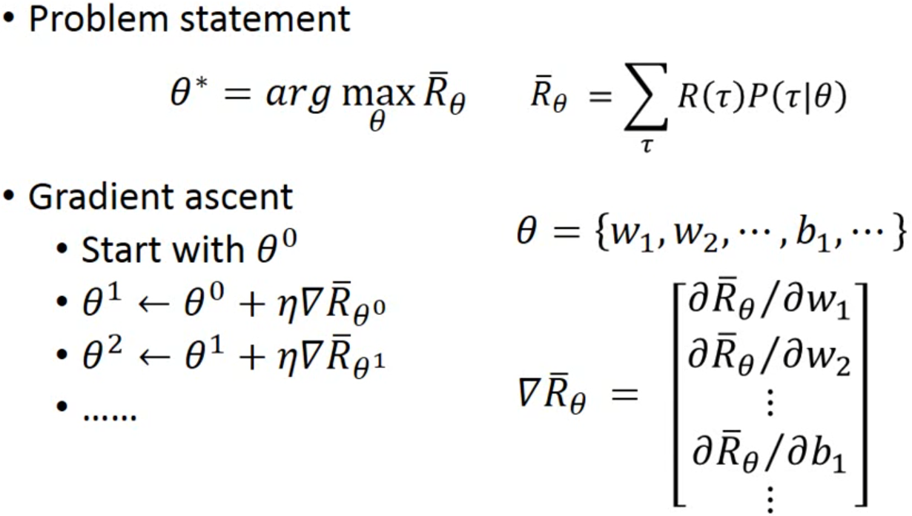
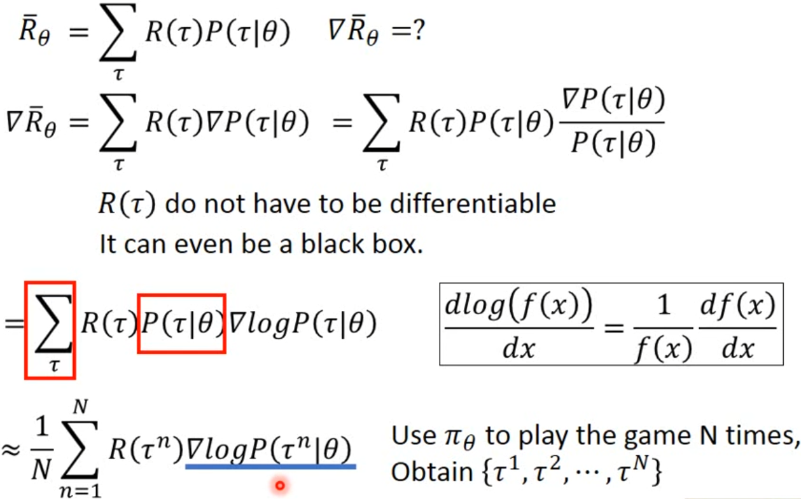
2. 对策略的概率进行求和近似等于采样n次取平均。
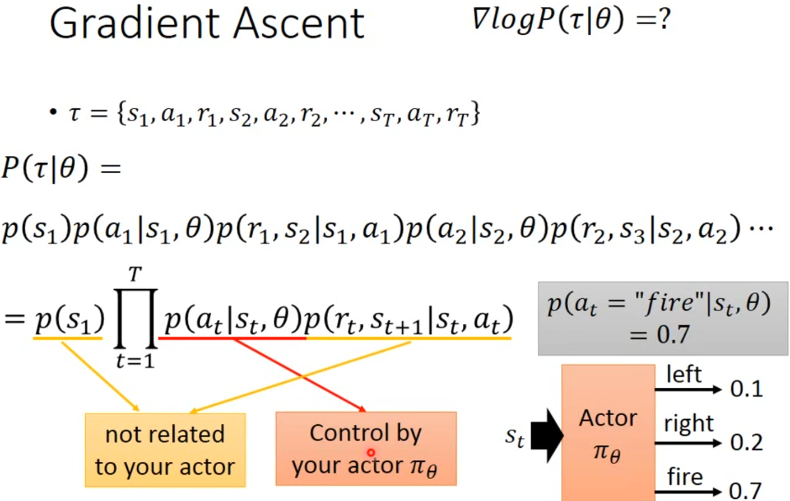
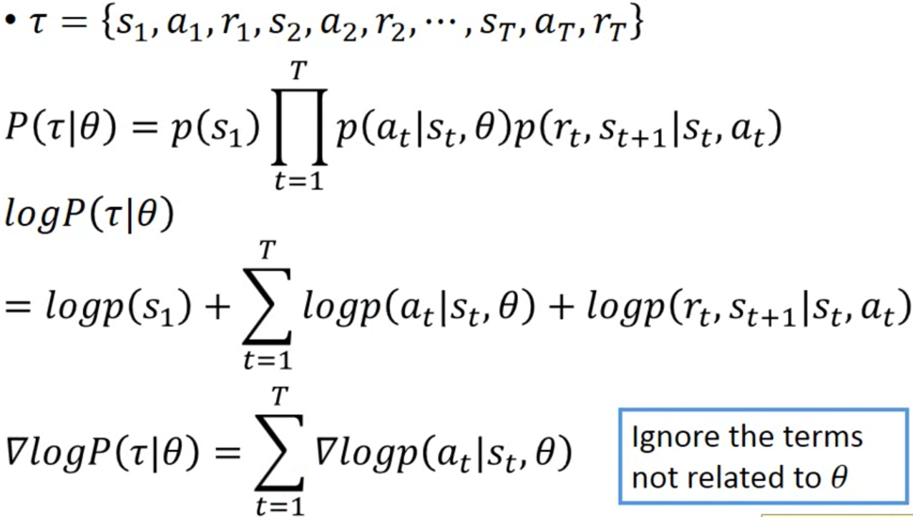
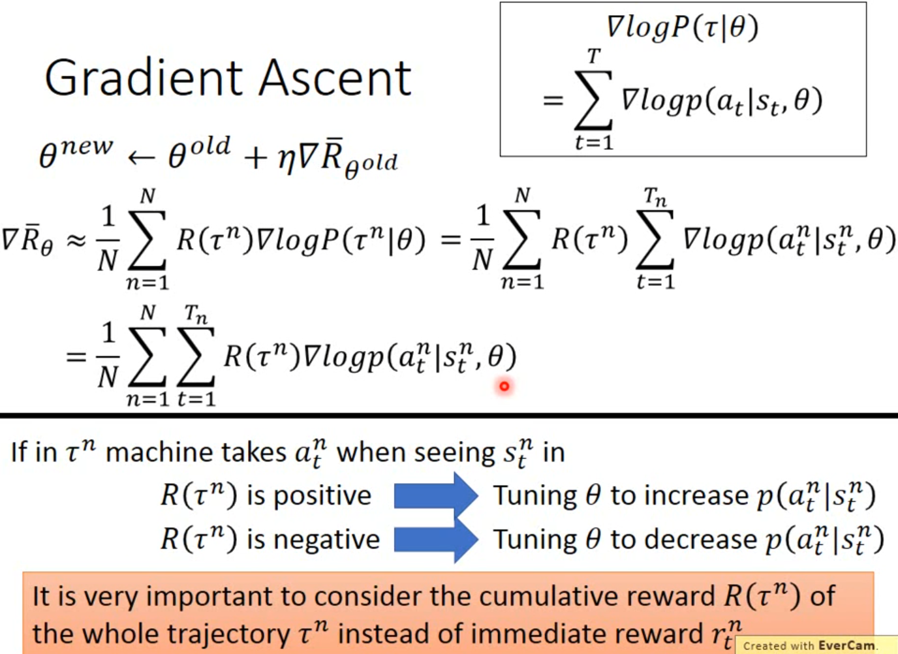
3. 注意总奖励Reward的表达式中是整个Trajectory的Reward，而不是采取某个Action后的即时奖励rt。
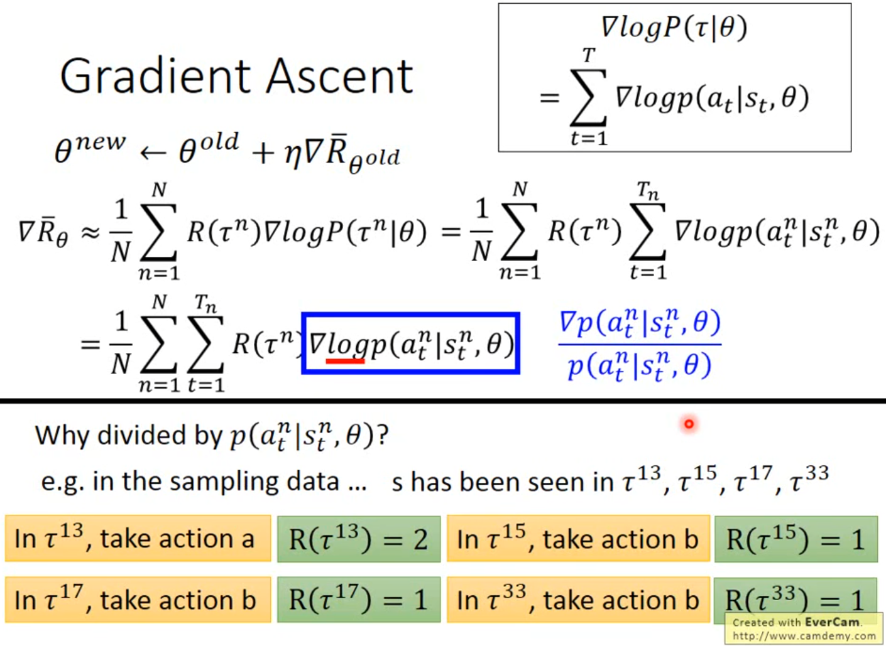
4. 采取logp的原因是考虑一种情况，在该情况下Actor采取某个ActionValue较小的Action的概率较大，Actor采取某个ActionValue较大的Action的概率较小，除掉概率相当于做一个normalization。

5. 添加Baseline：假设Actor在状态S时可以采取三个动作a、b、c，其中a和c的Reward较大，b的Reward较小。在理想情况下，三个动作都会被采样到，更新之后，a和c的采样概率增加，b的采样概率减小；但在实际情况下，a可能不会被采样到，只采样到b和c，因此a的采样概率会减小，b和c的采样概率会增加。所以需要将总奖励Reward期望值中的Trajectory Reward减去bias，使动作对应的Reward有正有负，采样到大于Baseline

换了一段

*斜体*

**加粗**

1. 强化学习
2. 深度学习
3. 666
   1. 二级
      1. 三级
         1. 111
            1. 111
               1. 111

还会

1. 111
2. 

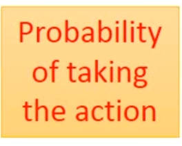  
*强化学习*

## Actor

## Critic

